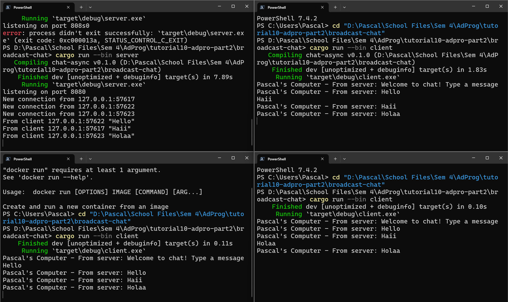

# Reflection 2.1

The screenshot above shows the program running one server and three clients. As seen above, when the clients are ran, they
all initially connect to the server through the same port. The way I did this was to start by opening four different instances
of Windows Powershell. Afterwards, to run the server, I used the command 'cargo run --bin server' and then 'cargo run --bin client'
on the remaining three instances of powershell for the clients. After doing so, I made sure to check that all the clients
are properly connected to the server which can be seen through the message "new connection from ...". After ensuring that all
clients have connected to the server, I started typing out messages from all the clients, checking to see if the server would
receive them. Moreover, the server could also tell us which client it received a message from through the message "From client ...".

# Reflection 2.2
When modifying the port to be 8080, on the server-side, the main function needs to be updated, more specifically the listening port. Moreover, after updating the server-side code, it is also important to update the client-side code to ensure that it connects to the same port. For the communication to work, the protocol being used is located in tokio::websockets, more specifically the client builder and server builder. After updating the port for both client-side and server-side code, the program should be able to properly listen to the same port, hence ensuring smooth communication between client and server.

# Reflection 3.3

